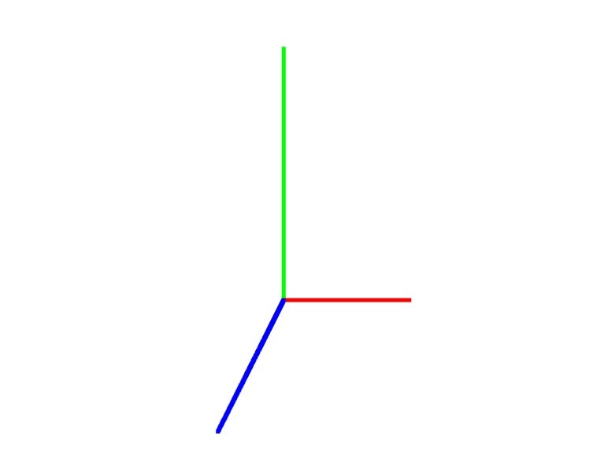
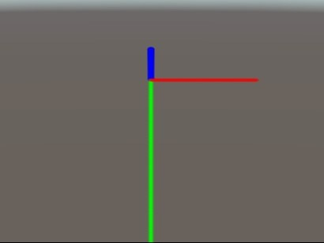
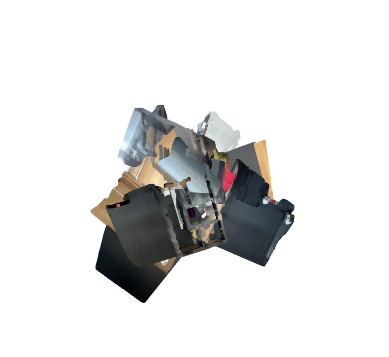
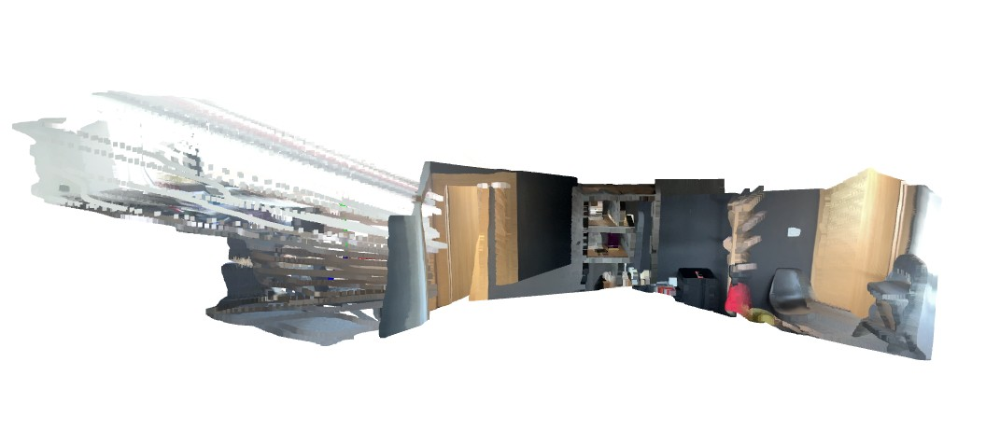
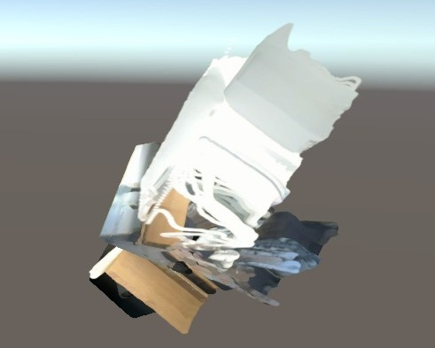
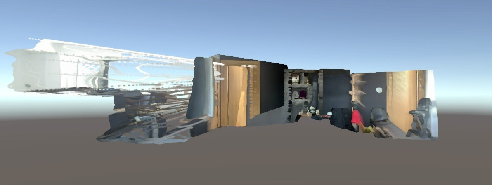

# Multi-Set Point Cloud Transformation for Custom Viewer Coordinate Systems

## Table of Contents
1. [Introduction](#1-introduction)
2. [Setup Guide](#2-setup-guide)
3. [Methodology](#3-methodology)
4. [Results](#4-results)
5. [References](#5-references)

---

## 1. Introduction
This repository contains a Python pipeline designed to transform three distinct sets of point clouds into the native coordinate system of a non-standardized 3D viewer, utilizing provided world-space camera poses. 

The primary objective of this project is to calculate and apply the exact mathematical transformations required to achieve a geometrically consistent scene within the target viewer. Custom 3D rendering engines often enforce specific intrinsic coordinate systems and handle transformation matrix decomposition (Translation, Rotation, Scale) differently than standard libraries. This script resolves issues such as mirrored environments, inverted axes, and geometric drift caused by quaternion limitations when handling reflection matrices.

**Development Environment:**
* **OS:** Windows 11
* **Language:** Python 3.12
* **Core Dependencies:** Open3D, NumPy

---

## 2. Setup Guide

To avoid dependency conflicts, it is highly recommended to run this project within a virtual environment or Conda environment.

### Creating an Environment

**Option A: Using Python `venv`**
```bash
# Create the virtual environment
python -m venv pcd_trx

# Activate the virtual environment (Windows)
pcd_trx\Scripts\activate
```

**Option B: Using Conda**
```bash
# Create the conda environment
conda create --name pcd_trx python=3.12

# Activate the environment
conda activate pcd_trx
```

### Installing Dependencies
Once your environment is active, install the required packages:
```bash
pip install -r requirements.txt
```

### Execution Instructions
Run the main script from the root directory:
```bash
python ./src/script.py
```

Upon successful execution, the newly transformed point cloud `.ply` files and the corrected `traj.txt` file will be generated in the `output_data/viewer_corrected` directory.

### Visualizing the Output
To view the results in the custom engine:
1. Copy the generated `.ply` files and paste them into: `ComputerVisionAssignment_Data/StreamingAssets/Points`
2. Copy the generated `traj.txt` file and paste it into: `ComputerVisionAssignment_Data/StreamingAssets`
3. Launch the viewer executable to visualize the geometrically consistent scene.

---

## 3. Methodology

The transformation pipeline was developed through a systematic reverse-engineering and mathematical correction process:

**Step 1: Baseline Orientation Analysis**
The initial phase involved loading the raw `.ply` point clouds and the original camera-to-world pose matrices into the Open3D coordinate system to identify baseline structural mismatches and orientation errors.

**Step 2: Deriving Geometric Corrections**
A series of transformation matrices were calculated to align the point clouds with the true camera path. This required isolating the exact orientation fixes, which included 180-degree rotations and specific axis flips (reflections) to un-mirror the scene and orient it right-side up relative to the global world space.

**Step 3: Permanent Transformation for Open3D Access**
The point clouds and the `traj.txt` file were mathematically transformed and exported as new sets. This process ensures that the geometrically consistent view is preserved and can be accessed permanently within the standard Open3D viewer for accurate verification.  

[o3d_correction.py](./src/modules/o3d_correction.py)

**Step 4: Reverse-Engineering the Target Coordinate System**
To identify the specific axes of the unknown 3D viewer, a dummy 3D coordinate frame (X, Y, Z axes) was generated in Open3D and loaded into the target viewer using an Identity matrix as the pose. This confirmed the target environment utilizes a **Right-Handed, Y-Down, and Z-Outward** coordinate system. 
    
[ax_calib.py](./src/modules/ax_calib.py)

 


**Step 5: Applying the Transformation Pipeline**
To bypass any internal viewer inconsistencies (such as localized centroid pivot drift during rotation), the final integration uses an absolute positioning approach:
1. **Direct World-Space Transformation:** The full compound equation (local sensor alignment + world-space camera path + final viewer orientation) is applied directly to the vertices of the point cloud `.ply'` files, baking them into their final absolute world positions.
2. **Identity Trajectory Generation:** The `traj.txt` file is decoupled from spatial calculations and populated exclusively with Identity Matrices.

    [script.py](./src/script.py)

This combination forces the viewer to render the exact, mathematically perfect geometry without attempting to apply any secondary, error-prone transformations on top of it.

---

## 4. Results

**Open3D Visualization:**
* Initial View in Open3D:  
  
* Transformed and Corrected View in Open3D:  
  

**Custom Viewer Visualization:**
* Initial Inconsistent View in Viewer:  
  
* Final Geometrically Consistent View in Viewer:  
  

---

## 5. References
* Spatial transformation resources and tutorials via YouTube.
* Open3D GitHub Discussions: [Issue #4641](https://github.com/isl-org/Open3D/issues/4641)
* Large Language Model Support: Google Gemini (Pro / Flash) for architectural debugging and mathematical matrix derivation.